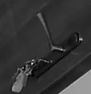

# Image Processing and Key Detection

This repository contains a Python script designed for detecting changes and identifying the presence of keys in an image using the Python Imaging Library (Pillow) and NumPy. The script is structured to be used in a Home Assistant environment for automation purposes via Pyscript.

## Features

- **Image Preprocessing:** Resizes and converts images to grayscale.
- **Difference Calculation:** Compares two images and highlights differences.
- **Change Detection:** Identifies the number of changed pixels in a specified region.
- **Key Detection:** Detects the presence of keys by comparing a region of an image against a reference image.
- **Home Assistant Integration:** Updates the state of an input boolean based on the detection result.

## File Structure

- **Script File:** `keys_detection.py`.
- **Images:**
  - `image_without_keys.png`: Reference image without keys.
  - `image_to_check.png`: Image to analyze for key presence.
  - `region_of_interest.png`: Cropped region used for detection (generated during runtime).

## Requirements

- Python 3.7+
- Pillow
- NumPy

## Installation

### Installing Pyscript in Home Assistant

To use this script in Home Assistant, you must install the Pyscript integration. For installation instructions, please refer to [this guide](https://github.com/custom-components/pyscript).

## Usage

### Example Workflow

For instance, when the door to the bedroom is closed during specific hours, a camera takes a snapshot and saves it as `image_to_check`. Then, this script runs and updates the input boolean state based on the detection of keys in the door. Finally, a notification is sent depending on the boolean state with last image as proof.

1. Place `image_without_keys.png` and `image_to_check.png` in the working directory.
2. Run `process_images` via Home Assistant using Pyscript.
3. Check the boolean state of `input_boolean.arekeysindoor` to verify results.

### Example Images

Below are the example images used in this script:

1. **Reference Image (`image_without_keys.png`):**
   

2. **Image to Check (`image_to_check.png`):**
   

3. **Region of Interest (`region_of_interest.png`):**
   

### Script Overview

The script includes the following main functions:

1. **`load_image(image_path)`**
   - Loads an image from a specified path.
   - Raises a `FileNotFoundError` if the file does not exist.

2. **`preprocess_image(image, target_size=None)`**
   - Resizes and converts an image to grayscale.

3. **`calculate_difference(image1, image2)`**
   - Calculates the difference between two images and applies a threshold.

4. **`detect_changes(image1, image2)`**
   - Detects changes between two images and logs the number of detected changes.

5. **`detect_keys_in_image(image, image_without_keys)`**
   - Crops a specific region from the images, processes it, and detects differences.
   - Saves the region of interest as `region_of_interest.png` for verification.

6. **`process_images()`**
   - Integrates with Home Assistant to update the state of `input_boolean.arekeysindoor` based on the detection results.

### Home Assistant Integration

- Use the `@service` decorator to call the `process_images` function from Home Assistant.
- The script toggles the state of `input_boolean.arekeysindoor` based on the presence of keys.

## Threshold Sensitivity

The sensitivity of detection is determined by the threshold value in `calculate_difference` and the change detection threshold in `detect_keys_in_image`. Adjust these values to suit your needs.

